# AnimalCLEF 2026 — 9th Place Solution

Wildlife individual re-identification as clustering.
**Final score: 0.47075 ARI | Rank: 9th | Best public: 0.51705 ARI**

---

## Competition

[AnimalCLEF 2026](https://www.kaggle.com/competitions/animal-clef-2026) is a wildlife clustering task:
given 2,409 unlabeled test images across four species, group images of the same individual without any known identity set. Evaluated by **Adjusted Rand Index (ARI)**.

| Species | Test images | Challenge |
|---|---|---|
| LynxID2025 | 946 | IR camera-trap, no segmentation |
| SalamanderID2025 | 689 | Deformable body, only 1.4k train images |
| SeaTurtleID2022 | 500 | High intra-individual variation |
| TexasHornedLizards | 274 | Zero training split — fully zero-shot |

---

## Architecture

```
Test images
    │
    ├── Global features
    │       ├── MiewID v3 (frozen, 2152-dim)
    │       └── MegaDescriptor-T-224 (ArcFace fine-tuned per-species, 768-dim)
    │
    ├── Local features (SAM3 mask-filtered keypoints)
    │       ├── SIFT + RootSIFT → BFMatcher
    │       ├── KAZE → BFMatcher
    │       └── ALIKED + LightGlue
    │
    └── Weighted ensemble → AgglomerativeClustering
            (AMI-calibrated thresholds per species)
```

**Best calibrated weights (V5.1):**

| Species | MiewID | MegaDesc | SIFT | KAZE | ALIKED | Threshold |
|---|---|---|---|---|---|---|
| Lynx | 0.10 | **0.50** | 0.05 | 0.00 | 0.35 | 0.57 |
| Salamander | 0.40 | 0.00 | 0.40 | 0.15 | 0.05 | 0.51 |
| SeaTurtle | 0.50 | 0.20 | 0.15 | 0.10 | 0.05 | 0.63 |
| THL | 0.275 | 0.275 | 0.15 | 0.10 | 0.20 | 0.30 |

---

## Score History

| Version | Score | Key change |
|---|---|---|
| V1 | 0.307 | MiewID + SIFT baseline |
| V1.3 | 0.325 | SAM3 keypoint mask filtering |
| V2.2 | 0.366 | RootSIFT (2 lines of numpy, +12.5%) |
| V2.3c | 0.377 | KAZE for THL and SeaTurtle |
| V2.5 | 0.447 | KAZE all species + AMI threshold calibration (+18.6%) |
| V2.8 | 0.462 | Salamander yellow-spot ROI mask |
| V3.2.2 | 0.479 | ALIKED+LightGlue + threshold ceiling fix |
| V4.0 | 0.486 | MegaDescriptor-L-384 as 2nd global model |
| **V5.1** | **0.517** | **ArcFace fine-tuned MegaDescriptor (CzechLynx data)** |

---

## Visualizations

### Extractor comparison — same individual vs different individual

Same individual (SIFT/KAZE/ALIKED finding consistent keypoints across re-sightings):

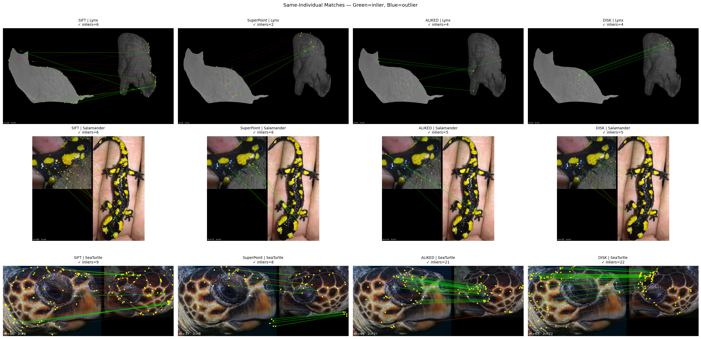

Different individual (matches drop off sharply — this is the signal we cluster on):

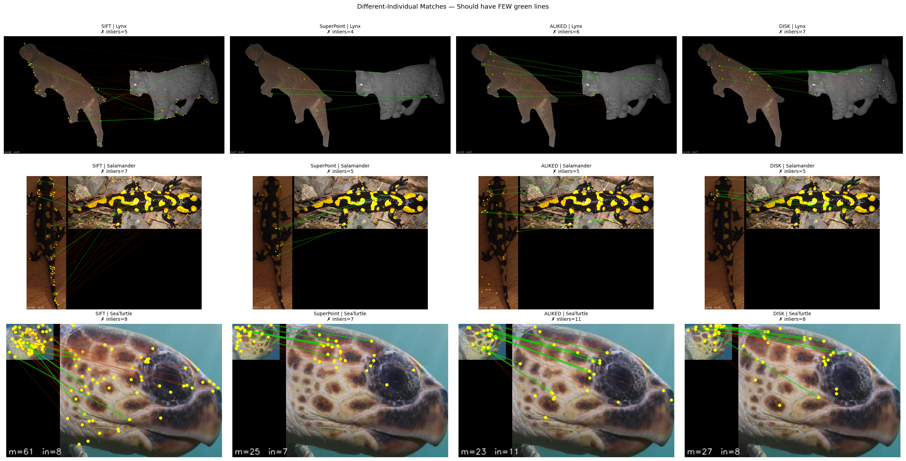

### Per-species similarity heatmaps

How similar embeddings are within vs across individuals for each species:

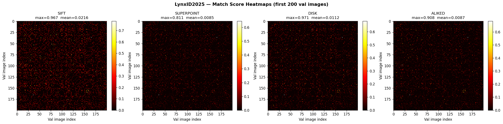
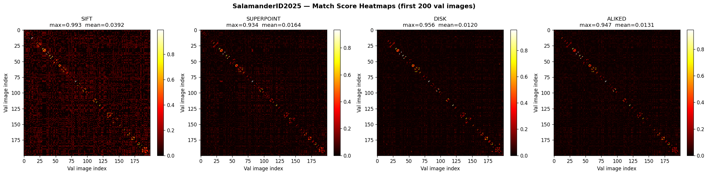
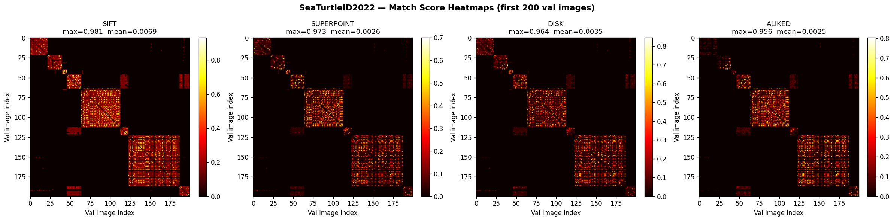

### Ablation — ensemble weights across versions

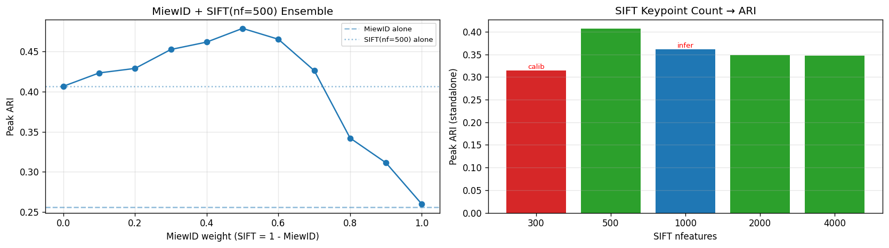

SIFT keypoint count ablation:

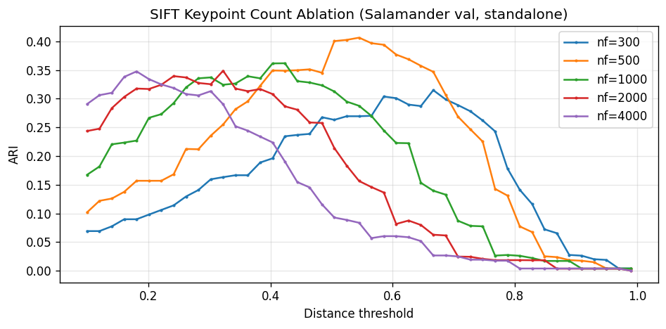

KAZE keypoint count ablation:

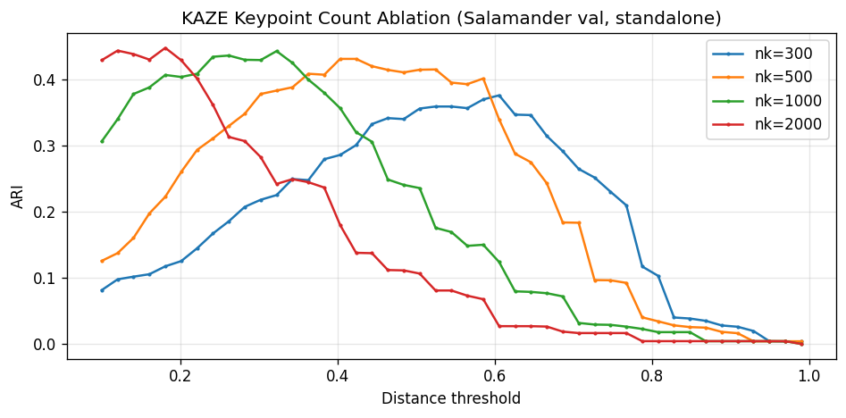

### Fine-tuning training curves (MiewID v3, V5.8)

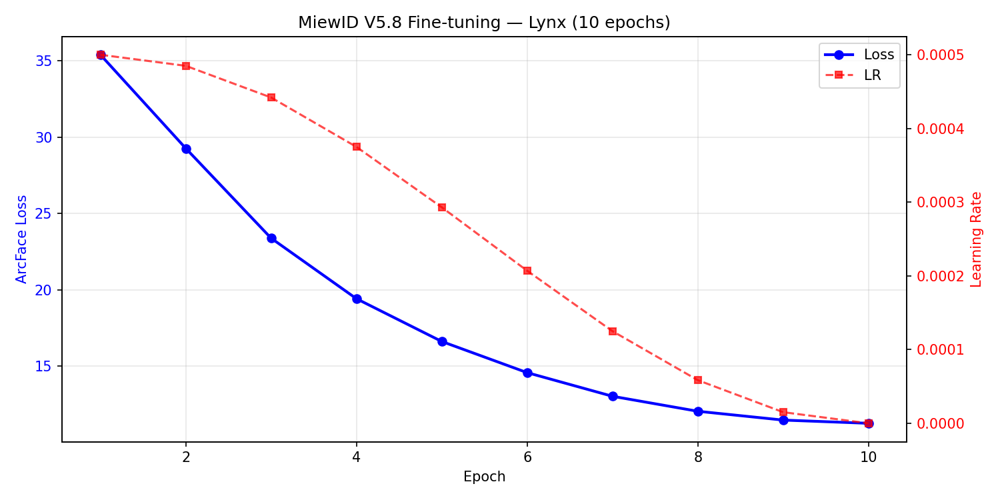
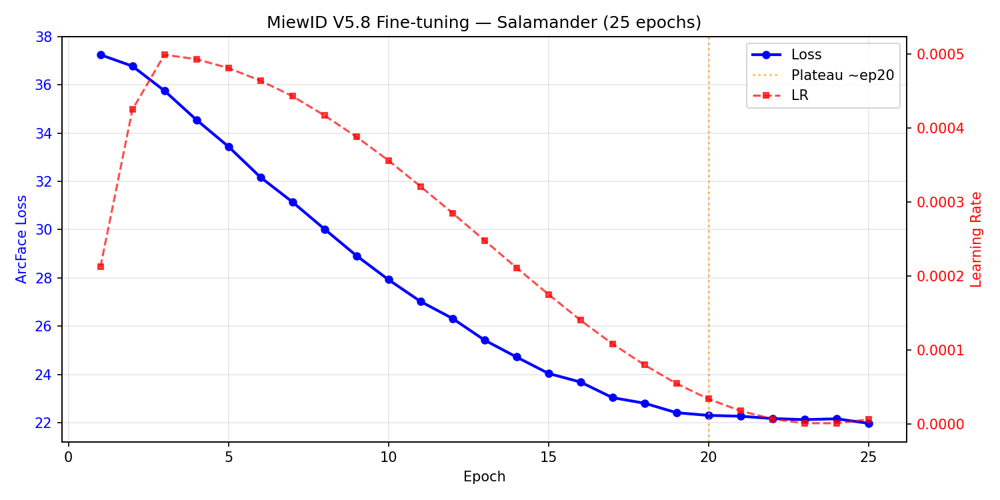
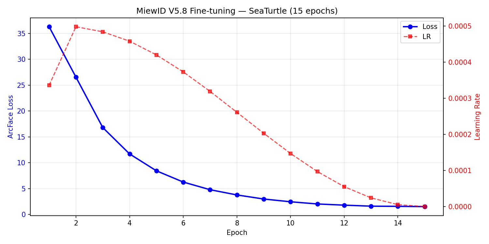

---

## EDA Notebooks

| Notebook | What it covers |
|---|---|
| [`eda/01_data_exploration.ipynb`](eda/01_data_exploration.ipynb) | Dataset overview, species breakdown, image statistics |
| [`eda/02_deep_dataset_analysis.ipynb`](eda/02_deep_dataset_analysis.ipynb) | Per-species deep dive, identity distribution, recapture rates |
| [`eda/03_pretrained_models_tutorial.ipynb`](eda/03_pretrained_models_tutorial.ipynb) | MiewID and MegaDescriptor baseline extraction walkthrough |
| [`eda/feature_visualization.ipynb`](eda/feature_visualization.ipynb) | Embedding space visualization, similarity heatmaps, extractor comparison |
| [`eda/salamander_benchmark.ipynb`](eda/salamander_benchmark.ipynb) | Salamander-specific analysis — hardest species deep dive |
| [`eda/gcnid_viz.ipynb`](eda/gcnid_viz.ipynb) | GCN-ID (external newt dataset) exploration |

---

## Key Findings

1. **SAM3 keypoint filtering**: Run extractors on raw images, then discard keypoints on background pixels. Never replace background before extraction — SIFT detects boundary edges as identity-irrelevant keypoints.

2. **RootSIFT**: Two lines of numpy (`L1 normalize → sqrt`). Converts L2 to Hellinger distance for SIFT descriptors. Free +12.5% improvement.

3. **Calibrate with AMI, not ARI**: The competition metric is ARI, but using ARI for threshold calibration causes systematic over-merging (rewards large clusters). AMI-calibrated thresholds consistently outperform ARI-calibrated ones.

4. **ArcFace fine-tuning + external data for Lynx**: CzechLynx (42k images) is critical. Train AMI went from 0.26 → 0.66 after fine-tuning MegaDescriptor on this dataset. Without external data, MegaDescriptor contributes nothing for Lynx.

5. **Salamander is the ceiling**: Only 1.4k training images for 587 identities. Fine-tuning never helps. No large-scale public fire salamander re-ID dataset exists.

6. **Never apply RootSIFT to KAZE**: KAZE produces signed M-SURF descriptors. `sqrt(negative) = NaN` → silent zero-match failure.

---

## Repo Structure

```
animalclef-2026-solution/
├── eda/                          ← exploratory notebooks
├── images/                       ← visualizations and training curves
│   ├── ablations/
│   ├── extractor_viz/
│   └── training_curves/
├── FINAL_SOLUTION_v1/            ← MiewID + SIFT baseline (0.307)
├── FINAL_SOLUTION_v1_2/          ← SAM3 white-bg attempt (failed, 0.263)
├── FINAL_SOLUTION_v1_3/          ← SAM3 keypoint filter fix (0.325)
├── FINAL_SOLUTION_v2_0/          ← LNBNN failure + postmortem (0.107)
├── FINAL_SOLUTION_v2_2/          ← +RootSIFT (0.366)
├── FINAL_SOLUTION_v2_3c/         ← +KAZE (0.377)
├── FINAL_SOLUTION_v2_5/          ← +AMI calibration (0.447)
├── FINAL_SOLUTION_v2_8/          ← +Salamander mask (0.462)
├── FINAL_SOLUTION_v3_2/          ← +ALIKED+LightGlue (0.479)
├── FINAL_SOLUTION_v3_3/          ← +SuperPoint failed attempt (0.472)
├── FINAL_SOLUTION_v4_0/          ← +Dual global MegaDesc (0.486)
├── FINAL_SOLUTION_v5_1/          ← ★ Fine-tuned MegaDesc, best (0.517)
├── baselines/                    ← V0 baseline scripts
├── src/                          ← shared utilities
├── ALL_EXPERIMENTS.md            ← full log of all 30+ experiments
├── SOLUTION_COMPARISON.md        ← version comparison table
└── SOLUTION_WRITEUP.md           ← full technical writeup
```

---

## Setup

```bash
source venv_animalclef2026/bin/activate
python -c "import wildlife_tools, torch; print(torch.__version__)"
```

Key packages: `wildlife-tools`, `wildlife-datasets`, `timm`, `torch`, `kornia`, `lightglue`

---

## Running on Kaggle

The submission notebooks are designed to run in Kaggle kernels. Required input datasets:

| Kaggle slug | Contents |
|---|---|
| `animal-clef-2026` | Competition data |
| `sreevaatsavbavana/megadesc-finetuned-v5` | Fine-tuned MegaDescriptor weights |
| `sreevaatsavbavana/animalclef-26-sam3` | SAM3 segmentation masks |
| `sreevaatsavbavana/version-4-cache` | Precomputed embeddings + local features |
| `picekl/czechlynx` | CzechLynx (42k lynx images, for fine-tuning) |

To reproduce V5.1 (best): run `FINAL_SOLUTION_v5_1/ensemble_global_local_reid_v5_1.ipynb` with the above datasets attached.

---

## Full Write-up

See [`SOLUTION_WRITEUP.md`](./SOLUTION_WRITEUP.md) for the complete technical write-up including all ablations, root-cause analyses for every regression, and a discussion of the public→private leaderboard drop.

---

## Acknowledgments

A good chunk of the code in this repo — debugging, refactoring, building the ensemble pipeline, fixing calibration bugs — was done iteratively with [Claude Code](https://claude.ai/code) (Anthropic). It was genuinely useful for this kind of research-engineering work: catching subtle bugs (RootSIFT on signed KAZE descriptors, calibration/inference pipeline mismatches, stale cache issues), helping structure the ablation process, and keeping track of what broke and why across 30+ experiments. Wanted to be upfront about that.

---

## References

- [MiewID](https://arxiv.org/abs/2412.05602) — `conservationxlabs/miewid-msv3`
- [MegaDescriptor / WildlifeReID-10k](https://arxiv.org/abs/2406.09211) — `BVRA/MegaDescriptor-*`
- [LightGlue](https://github.com/cvg/LightGlue) — attentional GNN keypoint matcher
- [WildlifeDatasets](https://wildlifedatasets.github.io/wildlife-datasets/) — unified wildlife re-ID datasets
- [AnimalCLEF 2025 overview](https://ceur-ws.org/Vol-4038/paper_231.pdf)
